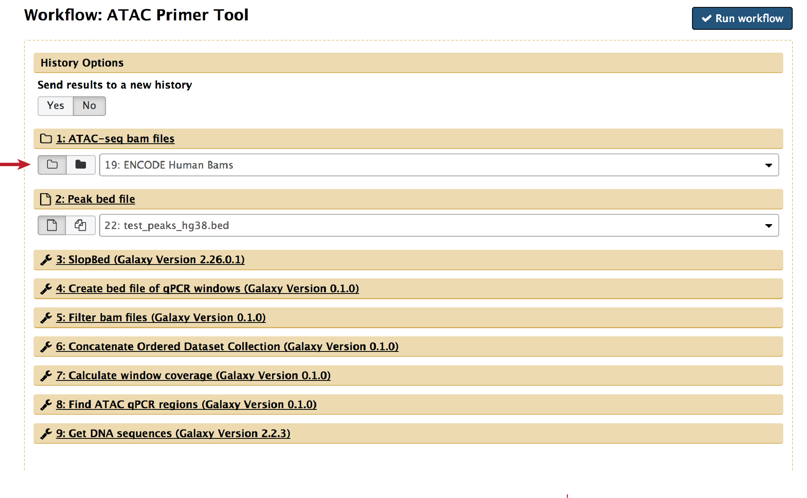

# Running APT with Galaxy

**In progress

## Overview
APT is also available as a Galaxy workflow.  The underlying code is the same as the command line version of APT.

## Getting Started
The APT workflow can be added from the Galaxy ToolShed using the instructions found [here](https://galaxyproject.org/toolshed/workflow-sharing/).
The workflow can be downloaded [here](galaxy/Galaxy-Workflow-ATAC_Primer_Tool.ga) or by searching "ATAC Primer Tool" 
in the workflows section of the Galaxy Toolshed Repository. Click on the workflow name and select **Install repository to local 
Galaxy** from the **Repository Actions** menu to install the workflow and required tools.  

Reference genomes should be locally downloaded and referenced in `tool-data`.  

## Usage 

APT requires ATAC-seq bam files to design optimal ATAC-qPCR primers. Bam files can be downloaded from public repositories such as ENCODE or 
GEO or user-generated to match your cell type of interest. A list of ATAC-seq datasets from a variety of both human and mouse tissue available 
from ENCODE is supplied in the APT manuscript.  

ATAC-seq bam files should be added to the Galaxy history as a dataset collection and the reference genome set for all files. Bam files must be 
from paired-end sequencing and sorted by position. The dataset collection containing bam files should be specified in step 1:

