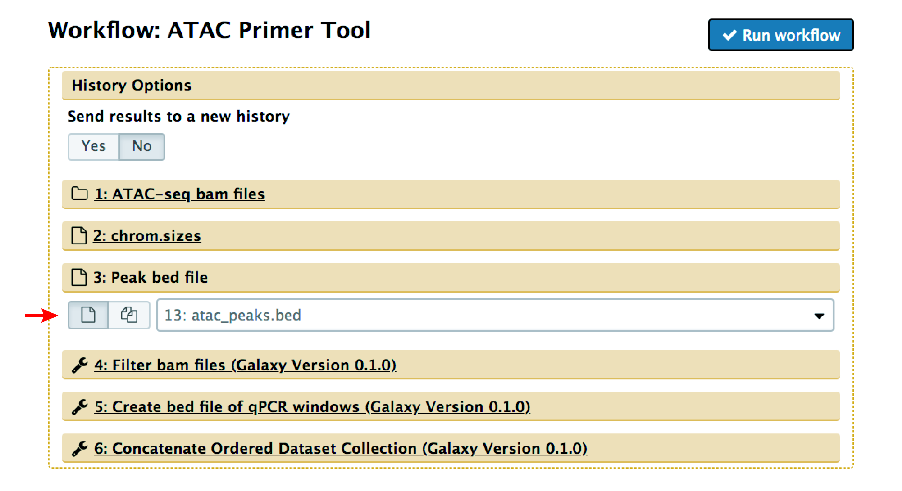
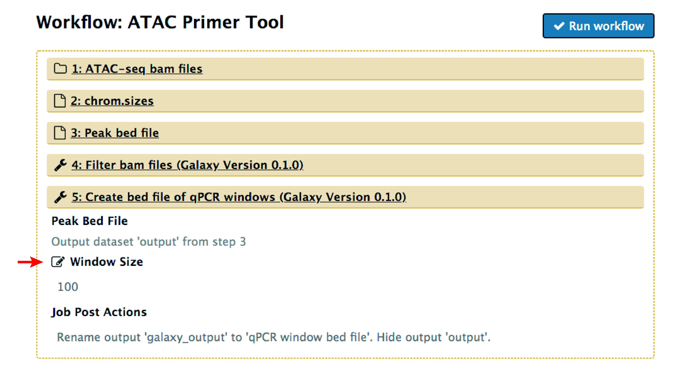
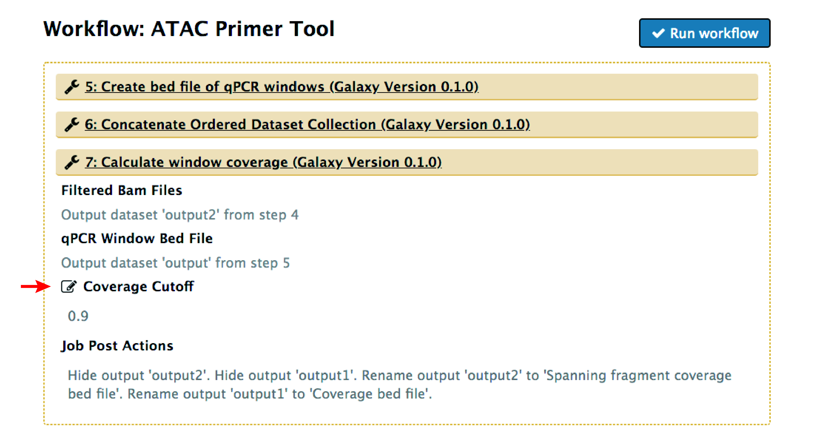

# Running APT with Galaxy

## Overview
APT is also available as a Galaxy workflow.  The underlying code is the same as the command line version of APT.

## Getting Started
The APT workflow can be added from the Galaxy ToolShed using the instructions found [here](https://galaxyproject.org/toolshed/workflow-sharing/).
The repository including tool dependencies and the APT Galaxy Workflow is available in the **Epigenetics** category as
[atac_primer_tool](https://toolshed.g2.bx.psu.edu/view/kyost/atac_primer_tool/fd3ea97a96bc). 

Reference genomes should be locally downloaded and referenced in `tool-data`.  

## Usage 

APT requires ATAC-seq bam files to design optimal ATAC-qPCR primers. Bam files can be downloaded from public repositories such as ENCODE or 
GEO or user-generated to match your cell type of interest. A list of ATAC-seq datasets from a variety of both human and mouse tissues available 
from ENCODE is supplied in the APT manuscript.  

ATAC-seq bam files should be added to the Galaxy history as a dataset collection and the reference genome set for all files. Bam files must be 
from paired-end sequencing and sorted by position. The dataset collection containing bam files should be specified in step 1 of the workflow:

APT also requires a bed file containing coordinates of ATAC-seq peaks for which primers should be designed. The bed file should have the same 
specified reference genome as the input bam files and is specified in step 3 of the workflow:

The APT workflow requires a genome size file from the Galaxy history.  Genome size files for some common reference genomes are available in [genomes](genomes/) and should be specified in step 2 of the workflow:

## Optional Arguments
There are multiple parameters of APT that can be modified, although the default parameters are a good place to start. In practice, we 
typically try a couple of different correlation cutoffs (i.e. 0.7, 0.8 and 0.9) to narrow down primer design regions if large regions 
are output using the defaults or to extend primer design regions if primers cannot be designed in the original region.

Window Size - window size in basepairs into which peaks are binned. Default is 100 and can be modified in step 5 of the workflow:
 

Fragment Overlap - percentage by which spanning fragments should overlap window to be counted. Default is 0.9 and can be modified in
step 7 of the workflow:

Correlation Cutoff - cutoff for correlation between number of spanning fragments in window and total peak height across samples. Default is 0.8.
Coverage Cutoff - cutoff for average spanning fragment coverage. Default is 3 (or ~500 copies/1ng input library).  
Both correlation and coverage cutoffs can be modified in step 8 of the workflow:

## Output
APT outputs a bed file named `ATAC qPCR regions` which contains genomic coordinates of optimal ATAC-qPCR regions. 
Each line of the output file has the chromosome, start and stop coordinates, followed by the region name 
(`PeakName_regionX`) in tab-delimited format for each ATAC-qPCR region identified. APT also outputs a fasta file
named `ATAC qPCR regions DNA sequences` containing the DNA sequence for optimal ATAC-qPCR regions. The DNA sequence 
of the output regions should be used to design qPCR primers using available tools such as Primer3. Additional 
information on primer design parameters is available in the ATAC Primer Tool manuscript.

## Designing normalizaton controls
Currently normalization controls can only be designed using the command line version APT. See [How to Design 
Normalization Controls](How_to_design_normalization_controls.md) for details.
